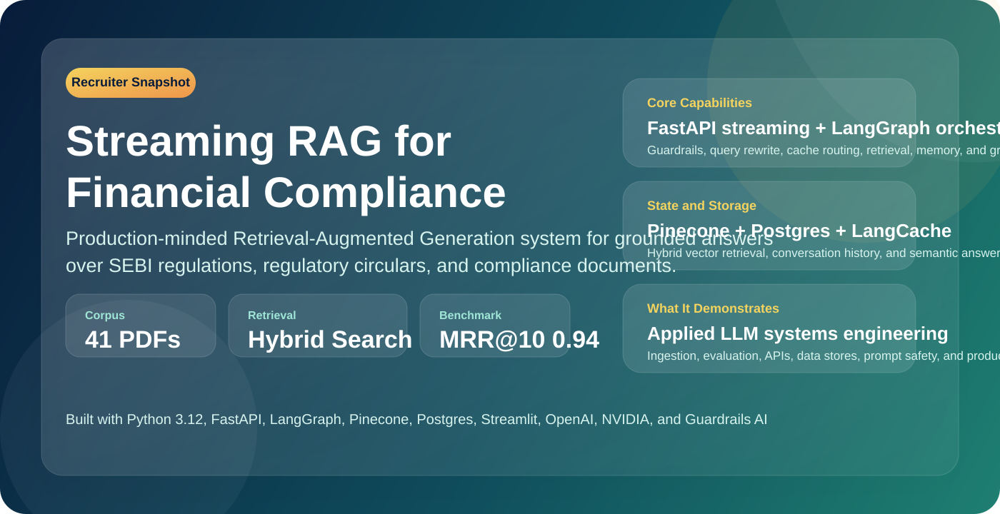

<p align="center">
  
</p>

<p align="center">
  
  
</p>

# Streaming RAG for Financial Compliance

End-to-end Retrieval-Augmented Generation system for financial compliance and regulatory research. The project ingests SEBI and related securities-market PDFs, indexes them with hybrid dense and sparse retrieval, serves grounded answers over a streaming FastAPI API, stores conversational context in Postgres, and optionally skips repeat work through semantic caching.

<p align="center">
  
  
  
  
  
  
</p>

## Executive Summary

This repository is a portfolio-quality LLM systems project built around a real domain: financial compliance. It demonstrates document ingestion, hybrid retrieval, workflow orchestration, prompt safety, stateful chat memory, semantic caching, streaming responses, and offline benchmarking in one cohesive application.

The system currently works over a corpus of `41` regulatory PDFs and ships with a reproducible retrieval-evaluation pipeline. For recruiters and hiring managers, this project is a concrete example of applied AI engineering rather than a toy chatbot: it connects data pipelines, vector search, backend APIs, storage systems, evaluation, and user experience into a complete product.

## What This Project Demonstrates

| Hiring Signal | Evidence in This Repository |
| --- | --- |
| End-to-end ownership | Built ingestion, retrieval, serving, caching, evaluation, and UI in one codebase |
| LLM systems engineering | Uses query rewriting, guardrails, grounded answer generation, and streaming output |
| Retrieval engineering | Combines dense OpenAI embeddings with SPLADE sparse retrieval in Pinecone |
| Backend engineering | FastAPI service with structured startup, stateful workflows, and persistent conversation memory |
| Data engineering | Processes a real PDF corpus, chunks documents, enriches metadata, and upserts vectors in batches |
| Systems thinking | Separates hot path serving, offline ingestion, and offline evaluation into clean workflows |
| Evaluation mindset | Includes `ranx`-based retrieval benchmarking with checked-in metrics |
| Production awareness | Adds semantic cache fallback behavior, logging, Dockerfiles, and database indexing |

## Project Snapshot

| Area | Detail |
| --- | --- |
| Domain | Financial compliance and regulatory question answering |
| Corpus | `41` PDFs in `documents/` |
| Backend | FastAPI |
| Orchestration | LangGraph |
| Dense retrieval | OpenAI `text-embedding-3-small` |
| Sparse retrieval | `naver/splade-cocondenser-ensembledistil` |
| Vector database | Pinecone hybrid index |
| LLMs | OpenAI `gpt-4o-mini` and NVIDIA `meta/llama-3.3-70b-instruct` |
| Guardrails | Guardrails AI topicality check for financial-compliance prompts |
| Conversation memory | Postgres via `asyncpg` |
| Semantic cache | Redis LangCache |
| Frontend | Streamlit |
| Evaluation | 4-stage retriever benchmark with `ranx` |

## Why The Design Is Strong

- Hybrid retrieval is a good fit for regulation-heavy text, where exact terminology matters and dense-only retrieval can miss critical wording.
- Query rewriting happens before cache lookup, which improves both retriever quality and cache reuse.
- The workflow keeps chat state in Postgres, so follow-up questions can stay contextual instead of stateless.
- The API streams answers token-by-token, which improves perceived latency for a chat experience.
- The semantic cache is model-namespaced and has failure cooldown logic, which makes caching safer in production-like conditions.
- Retrieval quality is measured with offline benchmarks instead of being assumed.

## How The System Works

### 1. Offline ingestion

The ingestion pipeline in `DocumentIngestion/` loads PDFs from `documents/`, splits them into `1000`-character chunks with `200` characters of overlap, generates dense and sparse representations, and upserts hybrid vectors into Pinecone in batches.

### 2. Online request handling

The serving path starts in the Streamlit client and reaches `POST /chat` in FastAPI. A LangGraph workflow then:

1. checks whether the question is on-topic for financial compliance,
2. rewrites the query for retrieval and caching,
3. checks semantic cache,
4. retrieves documents on cache miss,
5. loads recent conversation history from Postgres,
6. generates the final grounded answer,
7. stores the answer back in cache when caching is enabled.

### 3. Stateful conversations

Every user turn is persisted before downstream steps continue. On later turns, the backend reloads the most recent messages for the same `session_id` and injects them into the final-answer prompt to preserve continuity.

### 4. Multi-store architecture

This project uses different storage systems for different jobs:

- Pinecone stores hybrid dense and sparse representations of document chunks.
- Postgres stores chat history for multi-turn conversations.
- LangCache stores semantically similar prompts and their responses for low-latency reuse.

## Database And Data Layer

This project has two important persistent data layers and one optional cache layer:

| Layer | Purpose | What Is Stored |
| --- | --- | --- |
| Postgres | Conversation memory | Chat turns in a `messages` table with `id`, `session_id`, and `message` |
| Pinecone | Retrieval index | Dense vectors, sparse vectors, and chunk metadata such as `source`, `page`, and `text` |
| LangCache | Semantic response cache | Namespaced prompt-response pairs keyed by rewritten query and model |

The Postgres schema is intentionally lightweight: one row per message, indexed by `session_id`, then reconstructed into LangChain message objects at read time. That design keeps writes simple while still supporting multi-turn context.

## Retrieval Quality

The repository includes a reproducible benchmark workflow under `offline_retriever_eval/`:

1. sample `100` indexed chunks,
2. generate realistic user-style queries,
3. run the hybrid retriever,
4. score the results with `ranx`.

Checked-in metrics from `offline_retriever_eval/GoldenDataset/retrieval_metrics.csv`:

| Metric | Value |
| --- | ---: |
| `hit_rate@1` | `0.91` |
| `hit_rate@3` | `0.97` |
| `hit_rate@5` | `0.98` |
| `hit_rate@10` | `1.00` |
| `recall@10` | `1.00` |
| `precision@10` | `0.10` |
| `mrr@10` | `0.9413` |
| `map@10` | `0.9413` |
| `ndcg@10` | `0.9556` |

`precision@10` is low by design because the current benchmark treats the original chunk as the only relevant answer for each generated query. In that setup, `hit_rate`, `MRR`, `recall`, and `nDCG` are the more meaningful signals.

## Notable Engineering Decisions

- The topic guard runs before the rest of the workflow, which avoids wasting retrieval and generation cost on off-topic prompts.
- User messages are saved before query rewrite completes, so chat history is not lost if a later step fails.
- Assistant replies are saved on both cache-hit and cache-miss paths, which keeps conversation state consistent.
- Cache failures do not break the chat path. Instead, the cache layer temporarily disables itself and the system continues through the full RAG workflow.
- The backend pre-builds separate workflows for `nvidia` and `openai`, making model selection simple at request time.

## Technology Stack

| Category | Tools |
| --- | --- |
| Language | Python `3.12` |
| API | FastAPI, Uvicorn |
| Workflow orchestration | LangGraph |
| LLMs | OpenAI, NVIDIA |
| Embeddings | OpenAI embeddings, SPLADE sparse encoder |
| Retrieval store | Pinecone |
| Chat memory | Postgres, `asyncpg` |
| Semantic cache | LangCache, RedisVL |
| Guardrails | Guardrails AI |
| Frontend | Streamlit |
| Evaluation | Pandas, `ranx` |
| Tooling | `uv`, Ruff, Docker |

## Repository Layout

```text
.
├── app/                       # FastAPI app and chat route
├── rag_src/                   # LangGraph workflow, nodes, prompts, repositories
├── DocumentIngestion/         # PDF loading, chunking, and upsert pipeline
├── offline_retriever_eval/    # Retriever benchmark stages and artifacts
├── streamlit_chat_ui/         # Streamlit chat interface
├── documents/                 # SEBI and related regulatory PDFs
├── docs/images/               # README visuals and architecture diagrams
├── Dockerfile.backend         # Backend container image
├── Dockerfile.frontend        # Frontend container image
└── README.md
```

## Quick Start

### Prerequisites

- Python `3.12`
- `uv`
- Pinecone account and API key
- OpenAI API key
- NVIDIA API key
- Postgres instance
- Optional LangCache credentials

### Environment Variables

| Variable | Required | Purpose |
| --- | --- | --- |
| `OPENAI_API_KEY` | Yes | Dense embeddings and OpenAI answer path |
| `NVIDIA_API_KEY` | Yes | NVIDIA answer path and topicality guard |
| `PINECONE_API_KEY` | Yes | Pinecone index access |
| `DATABASE_URL` | Yes | Postgres connection string for conversation memory |
| `LANGCACHE_CACHE_ID` | No | Semantic cache identifier |
| `LANGCACHE_API_KEY` | No | Semantic cache API key |
| `LANGCACHE_SERVER_URL` | No | Optional LangCache server URL override |
| `LANGCACHE_TTL_SECONDS` | No | Cache TTL, default `900` |
| `LANGCACHE_FAILURE_COOLDOWN_SECONDS` | No | Cache backend cooldown, default `300` |
| `DATABASE_POOL_MIN_SIZE` | No | Postgres pool minimum, default `1` |
| `DATABASE_POOL_MAX_SIZE` | No | Postgres pool maximum, default `10` |
| `BACKEND_CHAT_URL` | Frontend only | Streamlit backend target, default `http://127.0.0.1:8000/chat` |

> [!IMPORTANT]
> Backend startup currently initializes both the `openai` and `nvidia` workflows. In practice, that means both provider keys should be present even if you only plan to query one provider.

### Install dependencies

```bash
uv sync
```

### Ingest the document corpus

```bash
uv run python DocumentIngestion/main.py
```

This step reads the PDFs, splits them into chunks, generates dense and sparse embeddings, and upserts them into Pinecone.

### Start the backend

```bash
uv run uvicorn app.main:app --host 0.0.0.0 --port 8000 --reload
```

### Start the frontend

```bash
uv run streamlit run streamlit_chat_ui/app.py
```

Then open [http://127.0.0.1:8501](http://127.0.0.1:8501).

## Docker

### Build images

```bash
docker build -f Dockerfile.backend -t rag-semantic-cache-backend .
docker build -f Dockerfile.frontend -t rag-semantic-cache-frontend .
```

### Run backend container

```bash
docker run --rm --env-file .env -p 8000:8000 rag-semantic-cache-backend
```

### Run frontend container

```bash
docker run --rm -e BACKEND_CHAT_URL=http://host.docker.internal:8000/chat -p 8501:8501 rag-semantic-cache-frontend
```

If you are not on macOS or Windows, replace `host.docker.internal` with a reachable host address.

## API Example

### `POST /chat`

```json
{
  "payload": "What are the disclosure requirements for listed entities?",
  "session_id": "demo-session-001",
  "llm": "nvidia"
}
```

Accepted `llm` values:

- `nvidia`
- `openai`

Response behavior:

- streams plain-text output,
- short-circuits off-topic prompts,
- uses recent conversation history for continuity,
- returns cached answers immediately when semantic cache hits.

## Key Files

- `app/main.py`: startup, dependency wiring, graph initialization
- `app/routes/chat.py`: streaming `/chat` endpoint
- `rag_src/graph.py`: workflow topology and routing
- `rag_src/nodes.py`: rewrite, cache, retrieval, memory, and answer-generation nodes
- `rag_src/repositories/pinecone_repository.py`: hybrid Pinecone retrieval and upsert logic
- `rag_src/repositories/conversation_db.py`: Postgres-backed conversation storage
- `rag_src/repositories/lang_cache.py`: Redis LangCache integration
- `DocumentIngestion/main.py`: ingestion entrypoint
- `offline_retriever_eval/stage1_get_chunks.py` to `stage4_ranx_evaluation.py`: benchmark workflow
- `streamlit_chat_ui/app.py`: Streamlit chat interface

## Current Gaps And Next Steps

- Add source citations with filename and page number in final answers.
- Expand automated testing around nodes, repositories, and API behavior.
- Add `docker compose` for one-command local startup.
- Lazy-load model workflows so the backend can boot with only one configured provider.
- Expose both providers in the Streamlit UI.
- Add latency, cache-hit, and retrieval observability.

## Closing Note

If you are reviewing this project as a recruiter, hiring manager, or engineer, the main takeaway is that this repository is not just a demo of calling an LLM API. It is a full retrieval system with ingestion, evaluation, orchestration, persistence, caching, and user-facing delivery stitched together as a practical AI application.
