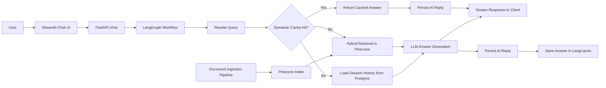
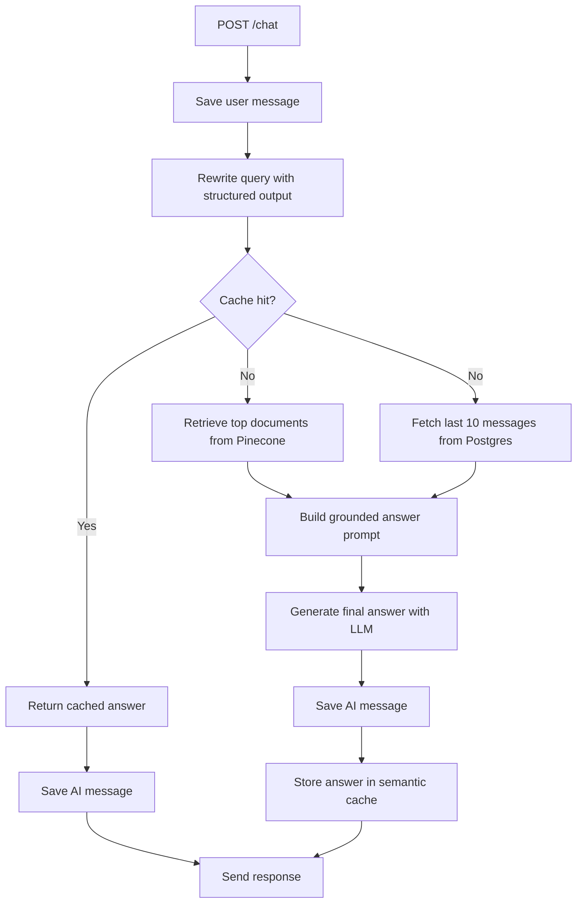
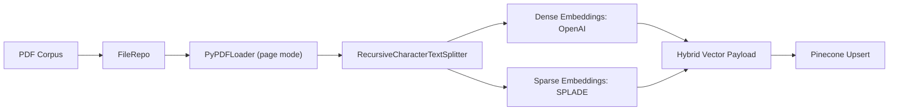

# StreamingRAG

A production-minded streaming Retrieval-Augmented Generation (RAG) system for regulatory and financial compliance question answering over a SEBI-centric corpus.

This project ingests regulatory PDFs, chunks and indexes them with hybrid dense + sparse embeddings in Pinecone, and serves grounded answers through a streaming FastAPI backend. The runtime workflow uses LangGraph to orchestrate query rewriting, semantic caching, hybrid retrieval, conversation memory, and final answer generation. A lightweight Streamlit client sits on top for interactive chat, and an offline evaluation pipeline measures retriever quality with `ranx`.

## Project Snapshot

- Domain: Indian securities-market and compliance documentation
- Corpus in this repo: 41 PDF documents under [`documents/`](documents/)
- Retrieval strategy: hybrid dense + sparse search
- Dense embeddings: OpenAI `text-embedding-3-small`
- Sparse embeddings: SPLADE via `naver/splade-cocondenser-ensembledistil`
- Vector database: Pinecone
- Orchestration: LangGraph
- API: FastAPI with streaming responses
- Conversation memory: Postgres via `asyncpg`
- Semantic cache: Redis LangCache
- UI: Streamlit chat client
- Offline benchmark: 100-query retriever evaluation with `ranx`

## Quick Start

```bash
uv sync
uv run python DocumentIngestion/main.py
uv run uvicorn app.main:app --host 0.0.0.0 --port 8000 --reload
uv run streamlit run streamlit_chat_ui/app.py
```

Then open [http://127.0.0.1:8501](http://127.0.0.1:8501) and point the UI to your backend if needed.

## What This Project Does

`StreamingRAG` is not just a chatbot wrapper around an LLM. It is a full retrieval system with separate ingestion, serving, memory, caching, and evaluation layers.

What has been implemented:

- A PDF ingestion pipeline that reads regulatory documents page-by-page, chunks them, and upserts them into Pinecone in batches
- Hybrid retrieval that combines OpenAI dense embeddings with SPLADE sparse embeddings for stronger search recall
- A LangGraph-powered RAG workflow that rewrites user queries before retrieval
- Semantic answer caching with Redis LangCache to reduce repeated LLM work
- Session-based conversation memory stored in Postgres
- Multi-provider LLM support through a strategy layer for OpenAI and NVIDIA models
- Streaming answer delivery from the FastAPI `/chat` endpoint
- A Streamlit interface for conversational testing
- A 4-stage offline retriever evaluation pipeline with saved benchmark artifacts
- Separate Dockerfiles for backend and frontend deployment

## Why This Project Stands Out

This repository reflects a practical engineering approach to RAG rather than a toy demo:

- The system separates ingestion, retrieval, orchestration, storage, and UI concerns cleanly
- Query rewriting happens before cache lookup, which improves cache consistency for semantically similar user prompts
- Cache failures degrade gracefully through a cooldown mechanism instead of taking down the chat path
- Conversation history is persisted independently of answer generation so context survives across turns
- Retrieval quality is measured offline with reproducible artifacts instead of being judged only by anecdotes
- The backend is designed around protocols, repositories, strategies, and services, making it easier to evolve components independently

## High-Level Architecture



## Runtime Request Flow

The backend compiles a LangGraph workflow per LLM provider at application startup. For every chat request, it executes the following path:



## Ingestion Pipeline

Documents are ingested separately from the serving path so indexing can be repeated without changing the online API.



Current ingestion defaults:

- Chunk size: `1000`
- Chunk overlap: `200`
- Pinecone metric: `dotproduct`
- Pinecone batch size: `200`

## Retrieval Evaluation

The repository includes an offline evaluation workflow under [`offline_retriever_eval/`](offline_retriever_eval/):

1. Sample 100 chunks from the Pinecone index
2. Generate user-style queries for each chunk
3. Retrieve top documents with the hybrid retriever
4. Score results with `ranx`

Latest checked-in metrics from [`offline_retriever_eval/GoldenDataset/retrieval_metrics.csv`](offline_retriever_eval/GoldenDataset/retrieval_metrics.csv):

| Metric | Value |
| --- | ---: |
| `hit_rate@1` | `0.91` |
| `hit_rate@3` | `0.97` |
| `hit_rate@5` | `0.98` |
| `hit_rate@10` | `1.00` |
| `recall@10` | `1.00` |
| `precision@10` | `0.10` |
| `mrr@10` | `0.9413` |
| `map@10` | `0.9413` |
| `ndcg@10` | `0.9556` |

Note on `precision@10`: the current evaluation labels one originating chunk as the sole relevant document for each generated query, so a perfect top-10 retrieval still caps precision at `0.10`. In this setup, `hit_rate`, `recall`, `MRR`, and `nDCG` are the more informative signals.

## Tech Stack

| Layer | Choice |
| --- | --- |
| Language | Python 3.12 |
| Package management | `uv` |
| API framework | FastAPI |
| Workflow orchestration | LangGraph |
| LLM providers | OpenAI, NVIDIA |
| Dense embeddings | OpenAI `text-embedding-3-small` |
| Sparse embeddings | SPLADE |
| Vector database | Pinecone |
| Cache | Redis LangCache |
| Conversation store | Postgres + `asyncpg` |
| Frontend | Streamlit |
| Evaluation | `pandas` + `ranx` |
| Logging | Loguru |
| Containers | Docker |

## Repository Layout

```text
.
├── app/                       # FastAPI application and routes
├── rag_src/                   # Core RAG workflow, nodes, prompts, LLMs, repos
├── DocumentIngestion/         # Offline ingestion and chunking pipeline
├── offline_retriever_eval/    # Retriever benchmarking pipeline and artifacts
├── streamlit_chat_ui/         # Streamlit frontend
├── documents/                 # Regulatory PDF corpus
├── Dockerfile.backend         # Backend container image
├── Dockerfile.frontend        # Frontend container image
├── pyproject.toml             # Project metadata and dependency groups
└── README.md
```

## Core Components

### Backend API

- Entry point: [`app/main.py`](app/main.py)
- Route: [`app/routes/chat.py`](app/routes/chat.py)
- Response mode: streamed plain text
- Endpoint: `POST /chat`

At startup, the app:

- Creates the Pinecone-backed vector store
- Connects to Postgres and auto-creates the `messages` table if needed
- Builds one LangGraph workflow per LLM provider
- Optionally enables LangCache if Redis credentials are available

### RAG Workflow

Key files:

- [`rag_src/graph.py`](rag_src/graph.py)
- [`rag_src/nodes.py`](rag_src/nodes.py)
- [`rag_src/services.py`](rag_src/services.py)

Responsibilities:

- Rewrite raw user input for better retrieval
- Check semantic cache before doing full RAG work
- Retrieve relevant documents from Pinecone
- Pull recent session history from Postgres
- Build the final grounded prompt
- Generate the answer and stream it back
- Persist the assistant response and cache it for future reuse

### Ingestion

Key files:

- [`DocumentIngestion/main.py`](DocumentIngestion/main.py)
- [`DocumentIngestion/pipeline.py`](DocumentIngestion/pipeline.py)
- [`DocumentIngestion/src/ingestion_and_chunk.py`](DocumentIngestion/src/ingestion_and_chunk.py)

Responsibilities:

- Read all PDFs from `documents/`
- Load pages with `PyPDFLoader`
- Split pages into overlapping text chunks
- Create dense and sparse embeddings
- Upsert vectors plus metadata into Pinecone

### UI

Key file:

- [`streamlit_chat_ui/app.py`](streamlit_chat_ui/app.py)

Features:

- Session-based conversational interface
- Configurable backend URL from the sidebar
- Streaming output rendering
- Quick reset for starting a new conversation

The backend is prepared for both `openai` and `nvidia` workflows. The current Streamlit UI exposes `nvidia` in the provider selector by default, while the backend API accepts both.

## Supported Data

The bundled corpus focuses on securities-market and compliance material, including:

- SEBI Acts and rules
- Securities Contracts regulations
- Depositories regulations
- Master circulars for brokers, advisers, CRAs, REITs, InvITs, and related market intermediaries

This makes the project especially relevant for financial compliance, legal research, regulatory operations, and internal knowledge-assistant use cases.

## Local Development

### Prerequisites

- Python `3.12`
- `uv`
- Access to Postgres
- Access to Pinecone
- OpenAI API credentials
- NVIDIA API credentials
- Optional LangCache credentials for semantic caching

### Environment Variables

The repository currently expects these variables:

| Variable | Required | Purpose |
| --- | --- | --- |
| `OPENAI_API_KEY` | Yes | Dense embeddings and OpenAI-backed workflow |
| `PINECONE_API_KEY` | Yes | Pinecone vector index access |
| `DATABASE_URL` | Yes | Postgres connection for chat history |
| `NVIDIA_API_KEY` | Yes | NVIDIA-backed workflow |
| `LANGCACHE_API_KEY` | No | LangCache semantic cache |
| `LANGCACHE_SERVER_URL` | No | LangCache backend URL |
| `LANGCACHE_CACHE_ID` | No | LangCache cache identifier |
| `LANGCACHE_TTL_SECONDS` | No | Cache TTL override |
| `LANGCACHE_FAILURE_COOLDOWN_SECONDS` | No | Cache failure cooldown |
| `DATABASE_POOL_MIN_SIZE` | No | Postgres pool minimum size |
| `DATABASE_POOL_MAX_SIZE` | No | Postgres pool maximum size |

Important note: the backend currently initializes both OpenAI and NVIDIA workflows at startup, so both provider keys should be present for the app to boot cleanly in its current form.

### Install Dependencies

```bash
uv sync
```

### 1. Run Document Ingestion

```bash
uv run python DocumentIngestion/main.py
```

This will:

- Read PDFs from [`documents/`](documents/)
- Chunk them
- Create the Pinecone index if it does not already exist
- Upsert vectors in batches

### 2. Run the Backend

```bash
uv run uvicorn app.main:app --host 0.0.0.0 --port 8000 --reload
```

Backend entry point:

- [`app/main.py`](app/main.py)

### 3. Run the Frontend

```bash
uv run streamlit run streamlit_chat_ui/app.py
```

Frontend default URL:

- [http://127.0.0.1:8501](http://127.0.0.1:8501)

### 4. Run Retriever Evaluation

```bash
uv run python offline_retriever_eval/stage1_get_chunks.py
uv run python offline_retriever_eval/stage2_generate_queries.py
uv run python offline_retriever_eval/stage3_get_relevant_docs.py
uv run python offline_retriever_eval/stage4_ranx_evaluation.py
```

## Docker

The repo ships with separate backend and frontend Dockerfiles.

### Build Images

```bash
docker build -f Dockerfile.backend -t streamingrag-backend .
docker build -f Dockerfile.frontend -t streamingrag-frontend .
```

### Run Backend Container

```bash
docker run --rm --env-file .env -p 8000:8000 streamingrag-backend
```

### Run Frontend Container

```bash
docker run --rm -e BACKEND_CHAT_URL=http://host.docker.internal:8000/chat -p 8501:8501 streamingrag-frontend
```

If you are not on macOS or Windows, replace `host.docker.internal` with a host address your container can reach.

## API Contract

### `POST /chat`

Request body:

```json
{
  "payload": "What are the disclosure requirements for listed entities?",
  "session_id": "demo-session-001",
  "llm": "nvidia"
}
```

Accepted `llm` values:

- `nvidia`
- `openai`

Response behavior:

- Returns a streamed plain-text answer
- Reuses conversation history for the provided `session_id`
- May return immediately from semantic cache if a matching rewritten query is found

## Engineering Decisions Worth Calling Out

### 1. Query Rewrite Before Retrieval and Cache Lookup

The system rewrites the user's question into a cleaner retrieval query before both search and cache lookup. That increases the odds that semantically equivalent prompts land on the same retrieval path and cache surface.

### 2. Hybrid Retrieval Instead of Dense-Only Search

Using dense embeddings alone can miss compliance-heavy terminology and exact regulatory phrasing. Pairing OpenAI dense vectors with SPLADE sparse vectors is a strong fit for regulation-focused corpora where both semantics and term specificity matter.

### 3. Graceful Cache Degradation

The LangCache wrapper marks the cache backend unavailable and enters a cooldown window on errors. That keeps the primary answer path functioning even when the cache tier is unhealthy.

### 4. Persistent Session Memory

Conversation history is stored in Postgres and replayed in chronological order for follow-up questions. This makes the system more useful for iterative legal and compliance research instead of single-turn Q&A only.

### 5. Evaluation as a First-Class Part of the Repo

The project includes a visible retriever benchmark pipeline with saved artifacts, which is a much stronger signal of engineering maturity than relying only on manual prompt testing.

## Current Scope and Next Improvements

This codebase already covers the core lifecycle of a real RAG application. Strong next steps would be:

- Add citation formatting back to the final answer so users can see exact source documents and pages
- Introduce automated tests for graph nodes, repository boundaries, and API behavior
- Add Docker Compose or a deployment manifest for one-command local startup
- Support per-provider lazy initialization so the backend can boot with only one LLM provider configured
- Add observability dashboards for latency, cache hit rate, and retrieval performance over time

## Summary

`StreamingRAG` is a solid end-to-end RAG system built with real software engineering structure:

- offline ingestion
- hybrid retrieval
- streaming generation
- semantic caching
- persistent conversation memory
- offline retriever evaluation
- containerized app surfaces

If you want a project that demonstrates practical GenAI backend engineering rather than a notebook-only prototype, this repository already tells that story well.
