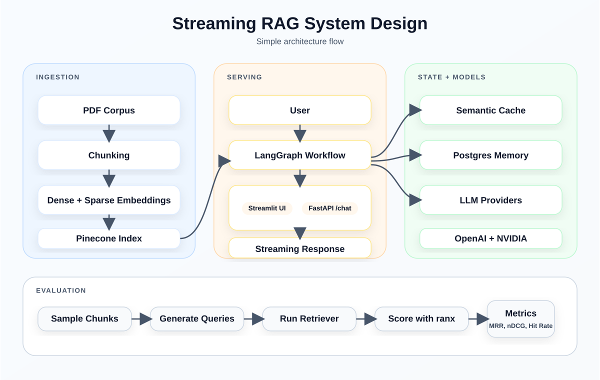
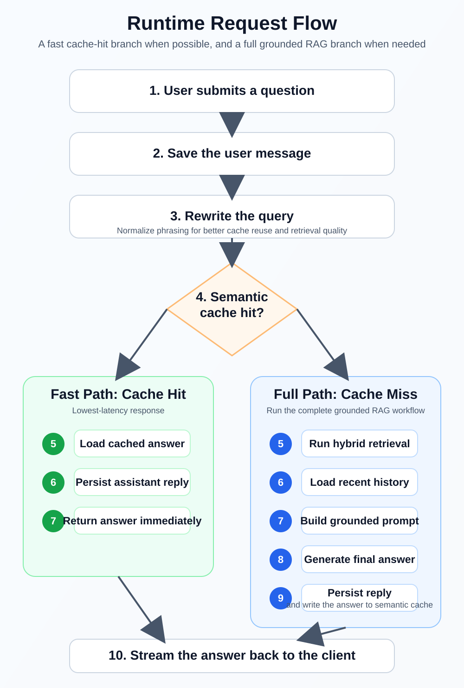

# Streaming RAG for Financial Compliance

Production-minded Retrieval-Augmented Generation system for financial compliance and regulatory research. This repository ingests a local corpus of SEBI and related securities-market PDFs, indexes them with hybrid dense and sparse retrieval, serves grounded answers over a streaming FastAPI API, and short-circuits repeated questions with semantic caching.

The codebase is organized around four workflows:

- Offline PDF ingestion and chunking
- Online question answering with LangGraph orchestration
- Semantic answer caching for repeated or near-duplicate requests
- Offline retriever evaluation with reproducible benchmark artifacts

<p align="center">
  
</p>
<p align="center"><em>Architecture overview: what gets indexed offline, what happens during a live request, and which systems hold retrieval, memory, and cache state.</em></p>

## Why This Repository Matters

- It uses hybrid retrieval, which is a better fit for regulation-heavy text than dense-only search.
- It rewrites the user query before cache lookup, improving both retrieval quality and cache reuse.
- It treats semantic caching as a first-class performance layer instead of an afterthought.
- It persists session history in Postgres, so follow-up questions can stay contextual.
- It streams answers from FastAPI for a more responsive chat experience.
- It includes an offline evaluation pipeline, so retrieval quality is measured instead of assumed.

## Project Snapshot

| Area | Detail |
| --- | --- |
| Domain | Financial compliance and regulatory question answering |
| Corpus | 41 PDF documents in `documents/` |
| Backend | FastAPI |
| Orchestration | LangGraph |
| Retrieval | Hybrid dense + sparse search in Pinecone |
| Dense embeddings | OpenAI `text-embedding-3-small` |
| Sparse embeddings | `naver/splade-cocondenser-ensembledistil` |
| LLM providers | OpenAI `gpt-4o-mini` and NVIDIA `meta/llama-3.3-70b-instruct` |
| Conversation memory | Postgres via `asyncpg` |
| Semantic cache | Redis LangCache |
| Frontend | Streamlit |
| Evaluation | 4-stage retriever benchmark with `ranx` |

## What the System Actually Does

### 1. Offline ingestion

The ingestion pipeline in `DocumentIngestion/` loads every PDF in `documents/`, reads each file page by page, splits the text into `1000`-character chunks with `200`-character overlap, generates both dense and sparse representations, and upserts the hybrid vectors into Pinecone.

### 2. Online request handling

The serving path starts in the Streamlit client, reaches FastAPI through `POST /chat`, and is orchestrated by a LangGraph workflow. The graph rewrites the incoming query, checks semantic cache, retrieves relevant documents on cache miss, loads recent conversation history, and generates the final answer with the selected LLM.

### 3. Stateful conversations

Every user turn is stored before downstream work begins. On later turns, the backend reloads recent session history from Postgres and injects it into the grounded answer prompt so follow-up questions remain coherent.

### 4. Optional semantic cache

When LangCache is configured, the rewritten query becomes the cache key. If a semantically equivalent question has already been answered for the same model namespace, the system can return the cached answer immediately and skip retrieval and generation work.

## Request Lifecycle

<p align="center">
  
</p>
<p align="center"><em>Request lifecycle: the query is normalized before cache lookup, then routed either to a low-latency cache-hit branch or to the full grounded RAG branch.</em></p>

Read the request flow like this:

- Shared preprocessing happens first for every request: accept the question, save the user turn, rewrite the query, and check cache.
- Cache-hit requests return immediately after loading the cached answer and persisting the assistant reply.
- Cache-miss requests fan out into retrieval and history loading, then join for grounded answer generation and cache write-back.

## Retrieval Evaluation

The repository includes a reproducible benchmark workflow under `offline_retriever_eval/`:

1. Sample 100 indexed chunks from Pinecone.
2. Generate realistic user-style queries for those chunks.
3. Run the hybrid retriever against the generated queries.
4. Score the results with `ranx`.

Latest checked-in metrics from `offline_retriever_eval/GoldenDataset/retrieval_metrics.csv`:

| Metric | Value |
| --- | ---: |
| `hit_rate@1` | `0.91` |
| `hit_rate@3` | `0.97` |
| `hit_rate@5` | `0.98` |
| `hit_rate@10` | `1.00` |
| `recall@10` | `1.00` |
| `precision@10` | `0.10` |
| `mrr@10` | `0.9413` |
| `map@10` | `0.9413` |
| `ndcg@10` | `0.9556` |

`precision@10` appears low because the current qrels treat the originating chunk as the only relevant result for each generated query. In that benchmark design, a perfect top-10 result list naturally caps `precision@10` at `0.10`, so `hit_rate`, `MRR`, `recall`, and `nDCG` are the more meaningful signals.

## Repository Layout

```text
.
├── app/                       # FastAPI app and API routes
├── rag_src/                   # LangGraph workflow, nodes, prompts, LLMs, repositories
├── DocumentIngestion/         # PDF loading, chunking, and upsert pipeline
├── offline_retriever_eval/    # Benchmark stages and saved evaluation artifacts
├── streamlit_chat_ui/         # Local Streamlit chat client
├── documents/                 # Financial compliance PDF corpus
├── docs/images/               # README architecture diagrams
├── Dockerfile.backend         # Backend container image
├── Dockerfile.frontend        # Frontend container image
└── README.md
```

## Important Files

- `app/main.py`: application startup, dependency wiring, and graph initialization
- `app/routes/chat.py`: streaming `/chat` endpoint
- `rag_src/graph.py`: LangGraph topology and cache-hit/cache-miss routing
- `rag_src/nodes.py`: query rewrite, cache, retrieval, memory, and answer-generation nodes
- `rag_src/repositories/pinecone_repository.py`: hybrid Pinecone retrieval and upsert logic
- `rag_src/repositories/conversation_db.py`: Postgres-backed conversation storage
- `rag_src/repositories/lang_cache.py`: Redis LangCache integration
- `DocumentIngestion/main.py`: ingestion entrypoint
- `offline_retriever_eval/stage1_get_chunks.py` to `stage4_ranx_evaluation.py`: evaluation pipeline
- `streamlit_chat_ui/app.py`: Streamlit chat interface

## Quick Start

### Prerequisites

- Python `3.12`
- `uv`
- Pinecone account and API key
- OpenAI API key
- NVIDIA API key
- Postgres instance
- Optional LangCache credentials for semantic cache

### Environment Variables

Set the following before running ingestion or the backend:

| Variable | Required | Purpose |
| --- | --- | --- |
| `OPENAI_API_KEY` | Yes | Dense embeddings and OpenAI-backed answer path |
| `NVIDIA_API_KEY` | Yes | NVIDIA-backed answer path |
| `PINECONE_API_KEY` | Yes | Pinecone index access |
| `DATABASE_URL` | Yes | Postgres connection string for conversation memory |
| `LANGCACHE_CACHE_ID` | No | Semantic cache identifier |
| `LANGCACHE_API_KEY` | No | Semantic cache API key |
| `LANGCACHE_SERVER_URL` | No | Optional LangCache server URL override |
| `LANGCACHE_TTL_SECONDS` | No | Cache TTL override, default `900` |
| `LANGCACHE_FAILURE_COOLDOWN_SECONDS` | No | Cache backend failure cooldown, default `300` |
| `DATABASE_POOL_MIN_SIZE` | No | Postgres pool minimum, default `1` |
| `DATABASE_POOL_MAX_SIZE` | No | Postgres pool maximum, default `10` |
| `BACKEND_CHAT_URL` | Frontend only | Streamlit backend target, default `http://127.0.0.1:8000/chat` |

> [!IMPORTANT]
> In the current implementation, backend startup initializes both `openai` and `nvidia` graphs. That means both provider keys should be present even if you plan to use only one provider at request time.

### Install Dependencies

```bash
uv sync
```

### Ingest the Corpus

```bash
uv run python DocumentIngestion/main.py
```

This job:

- loads PDFs from `documents/`
- chunks them with overlap
- generates dense and sparse embeddings
- upserts hybrid vectors into Pinecone

### Run the Backend

```bash
uv run uvicorn app.main:app --host 0.0.0.0 --port 8000 --reload
```

### Run the Frontend

```bash
uv run streamlit run streamlit_chat_ui/app.py
```

Then open [http://127.0.0.1:8501](http://127.0.0.1:8501).

## Docker

The repository ships separate backend and frontend images.

### Build

```bash
docker build -f Dockerfile.backend -t rag-semantic-cache-backend .
docker build -f Dockerfile.frontend -t rag-semantic-cache-frontend .
```

### Run the Backend Container

```bash
docker run --rm --env-file .env -p 8000:8000 rag-semantic-cache-backend
```

### Run the Frontend Container

```bash
docker run --rm -e BACKEND_CHAT_URL=http://host.docker.internal:8000/chat -p 8501:8501 rag-semantic-cache-frontend
```

If you are not on macOS or Windows, replace `host.docker.internal` with a reachable host address.

## API Contract

### `POST /chat`

Request body:

```json
{
  "payload": "What are the disclosure requirements for listed entities?",
  "session_id": "demo-session-001",
  "llm": "nvidia"
}
```

Accepted `llm` values:

- `nvidia`
- `openai`

Behavior:

- response body is streamed as plain text
- recent conversation history is used for continuity
- cached answers are returned immediately when semantic cache hits

## Implementation Notes

- The Streamlit UI currently exposes `nvidia` in `AVAILABLE_LLMS`, while the API itself supports both `nvidia` and `openai`.
- The backend stores raw conversation turns in Postgres with lightweight role prefixes and rehydrates them into LangChain message types at read time.
- The backend Docker image packages serving code only; ingestion and evaluation continue to run from the Python workspace.

## Suggested Next Steps

- Add citations with source filename and page number in the final answer.
- Add automated tests for nodes, repositories, and API behavior.
- Add one-command local orchestration with `docker compose`.
- Lazy-load LLM workflows so the backend can boot with a single configured provider.
- Add runtime observability for latency, cache hit rate, and retrieval quality.

## Summary

This repository is not a notebook demo. It is a modular RAG system for financial compliance research with a clear ingestion path, a measurable retriever, a streaming answer API, persistent conversation state, and a semantic cache layer that meaningfully improves repeat-query performance.
