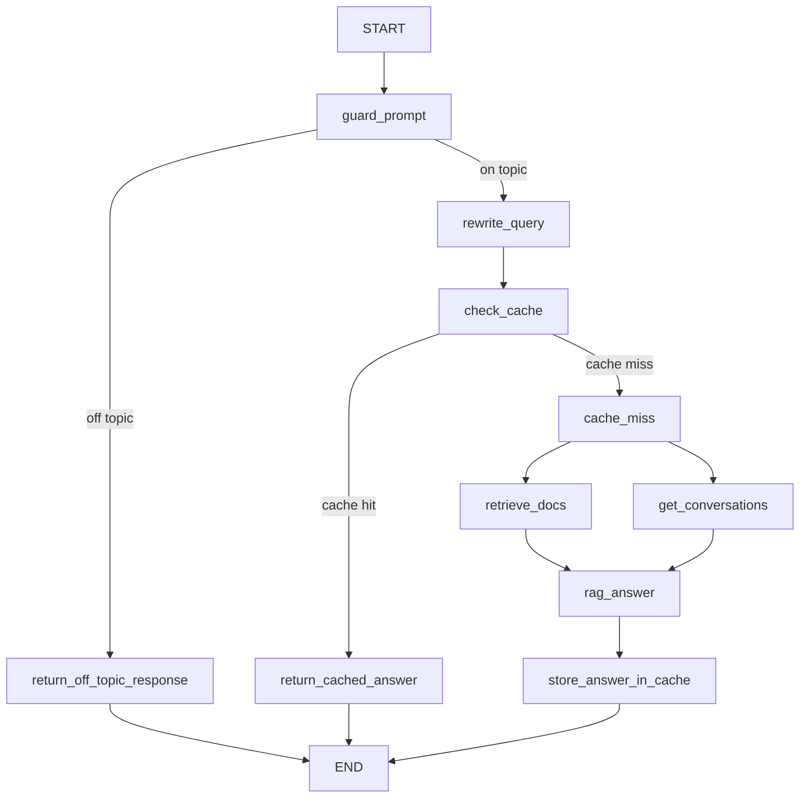

# Technical Documentation: Streaming RAG for Financial Compliance

## Table of Contents

1. [Purpose and Scope](#purpose-and-scope)
2. [System Overview](#system-overview)
3. [Architecture Summary](#architecture-summary)
4. [Repository Layout](#repository-layout)
5. [Runtime Architecture](#runtime-architecture)
6. [Retrieval and Indexing](#retrieval-and-indexing)
7. [Data Storage Model](#data-storage-model)
8. [Prompting and Guardrails](#prompting-and-guardrails)
9. [API Contract](#api-contract)
10. [Frontend Application](#frontend-application)
11. [Offline Retrieval Evaluation](#offline-retrieval-evaluation)
12. [Configuration and Environment Variables](#configuration-and-environment-variables)
13. [Deployment Model](#deployment-model)
14. [Observability and Failure Handling](#observability-and-failure-handling)
15. [Known Limitations and Technical Debt](#known-limitations-and-technical-debt)
16. [Extension Points](#extension-points)

## Purpose and Scope

This document describes the implementation, runtime behavior, storage model, and operational characteristics of the `streamingrag` project.

The repository is an end-to-end Retrieval-Augmented Generation system for financial compliance research. It ingests a regulatory PDF corpus, indexes it into Pinecone using hybrid dense and sparse retrieval, serves grounded answers over a streaming FastAPI API, preserves multi-turn conversation context in Postgres, and optionally short-circuits repeated work through semantic caching.

This document is intended for:

- engineers onboarding to the codebase,
- reviewers evaluating the system design,
- maintainers operating or extending the application,
- developers integrating the backend or ingestion pipeline into a broader platform.

## System Overview

At a high level, the project is split into five major concerns:

| Concern | Implementation |
| --- | --- |
| Online serving | FastAPI endpoint in `app/` backed by LangGraph workflows |
| Retrieval and generation | `rag_src/` with prompts, graph nodes, repositories, and strategy abstractions |
| Corpus ingestion | `DocumentIngestion/` pipeline for PDF loading, chunking, embedding, and Pinecone upsert |
| User interface | Streamlit chat client in `streamlit_chat_ui/` |
| Offline evaluation | `offline_retriever_eval/` scripts and checked-in benchmark artifacts |

The corpus currently contains `41` PDF documents under `documents/`, primarily SEBI and related securities-market regulations.

## Architecture Summary


### Primary design choices

1. The application uses hybrid retrieval rather than dense-only search. Dense OpenAI embeddings capture semantic similarity, while SPLADE sparse vectors preserve exact regulatory terminology and keyword specificity.
2. Query rewriting happens before cache lookup. This improves both retrieval quality and semantic cache reuse by normalizing equivalent user prompts into a more stable key.
3. Conversation memory is persisted outside the request process. The backend stores chat turns in Postgres and reloads recent history for follow-up questions.
4. The hot path is resilient to optional subsystem failures. If semantic cache or message persistence fails, the request path logs the error and continues wherever possible.
5. The architecture separates offline ingestion, online serving, and offline evaluation into distinct workflows, which keeps responsibilities clear and operationally safer.

## Repository Layout

| Path | Responsibility |
| --- | --- |
| `app/` | FastAPI startup and API routing |
| `rag_src/` | LangGraph workflow, prompt templates, repositories, embeddings, LLM strategies, state definitions |
| `DocumentIngestion/` | Offline ingestion pipeline from PDFs to Pinecone |
| `offline_retriever_eval/` | Retriever evaluation scripts and benchmark outputs |
| `streamlit_chat_ui/` | Developer-facing Streamlit frontend |
| `documents/` | Regulatory PDF corpus used for ingestion |
| `docs/images/` | Architecture and flow diagrams used in project documentation |
| `Dockerfile.backend` | Container image for the FastAPI service |
| `Dockerfile.frontend` | Container image for the Streamlit client |

## Runtime Architecture

### Application startup

The FastAPI application is defined in `app/main.py`. Startup work is performed in an async lifespan handler rather than at import time.

Startup sequence:

1. Load environment variables via `python-dotenv`.
2. Configure Loguru file logging under `logs/`.
3. Instantiate shared embedding strategies:
   - dense: `OpenAIEmbedding`
   - sparse: `SentenceTransformerSparseEmbedding`
4. Instantiate the Pinecone repository used for hybrid search.
5. Require `DATABASE_URL`, connect to Postgres, and ensure the `messages` table and session index exist.
6. Build a topic guardrail using the NVIDIA-backed LLM strategy.
7. Build one LangGraph workflow per supported answer provider: `nvidia` and `openai`.
8. Optionally attach a LangCache semantic cache instance to each workflow when cache configuration is present.
9. Store compiled graphs in `app.state.graphs` for later request dispatch.

Two details are worth calling out:

- The vector store and conversation database are shared across both workflows.
- Backend startup initializes both provider workflows unconditionally, so both provider API keys are effectively required with the current design.

### Request lifecycle

The only API route in the repository is `POST /chat` in `app/routes/chat.py`.

Request body:

```json
{
  "payload": "What are the disclosure requirements for listed entities?",
  "session_id": "demo-session-001",
  "llm": "nvidia"
}
```

Runtime behavior:

1. The route selects the prebuilt LangGraph workflow using `chat_request.llm`.
2. The graph is invoked with two state keys:
   - `query`
   - `session_id`
3. The route consumes the graph with `stream_mode=["messages", "updates"]`.
4. If the active LLM emits streaming message chunks from the `rag_answer` node, the route yields them immediately.
5. If the request ends on a non-streaming branch such as cache hit or off-topic rejection, the route yields the final answer from the node update payload instead.
6. The response is returned as a plain-text `StreamingResponse`.

This design allows the same API contract to support both:

- fully generated RAG responses that stream incrementally,
- short-circuit responses that are computed in a single step.

### LangGraph workflow topology

The graph is assembled in `rag_src/graph.py`. It models the request as a stateful workflow over `AgentState`.



### Node responsibilities

| Node | Responsibility |
| --- | --- |
| `guard_prompt` | Run the topicality guardrail and set `is_on_topic` |
| `return_off_topic_response` | Return a fixed rejection message for off-topic prompts |
| `rewrite_query` | Persist the human message, rewrite the query with structured LLM output, and set `rewritten_query` |
| `check_cache` | Attempt semantic cache lookup using the rewritten query |
| `return_cached_answer` | Persist cached assistant output and return it immediately |
| `cache_miss` | Marker node used to branch into retrieval and conversation loading |
| `retrieve_docs` | Run Pinecone hybrid search and attach retrieved documents |
| `get_conversations` | Load recent session history from Postgres |
| `rag_answer` | Build the final answer prompt, generate the response, and persist the assistant message |
| `store_answer_in_cache` | Write the answer into LangCache when enabled |

### State model

The graph state is defined in `rag_src/state.py` as a `TypedDict`.

Required fields:

- `query`
- `session_id`

Optional fields added during workflow execution:

- `is_on_topic`
- `rewritten_query`
- `cache_key`
- `cache_hit`
- `cached_answer`
- `retrieved_docs`
- `past_conversations`
- `final_answer`

### Service and strategy layer

`rag_src/services.py` contains `RagWorkflowService`, a thin facade that keeps nodes independent from concrete LLM and vector-store implementations.

Abstractions used by the service layer:

- `LLMStrategy`: implemented by `OpenAILLM` and `NVIDIALLM`
- `VectorDBProtocol`: implemented by `PineconeRepository`
- `CacheProtocol`: implemented by `RedisLangCache`

This design keeps the graph nodes focused on workflow control while the provider-specific logic stays inside dedicated strategy or repository classes.

## Retrieval and Indexing

### Ingestion pipeline

The ingestion entry point is `DocumentIngestion/main.py`. It wires together the document source, splitter, embedding models, vector repository, and pipeline runner.

Ingestion sequence:

1. `FileRepo` enumerates `.pdf` files from the `documents/` directory.
2. `ChunkerService` loads each PDF with `PyPDFLoader` in page mode.
3. `RecursiveCharacterTextSplitterMethod` splits the loaded pages into chunks.
4. `UpsertService` forwards the chunks to `PineconeRepository.upsert_chunks`.
5. Pinecone vectors are embedded and upserted in batches.

Current chunking configuration:

| Setting | Value |
| --- | --- |
| Chunk size | `1000` characters |
| Chunk overlap | `200` characters |
| Pinecone batch size | `200` chunks |

### Embeddings

Two embedding systems are used throughout ingestion and retrieval:

| Type | Implementation | Model |
| --- | --- | --- |
| Dense | `rag_src/embeddings/openai_embedding.py` | `text-embedding-3-small` |
| Sparse | `rag_src/embeddings/splade_sparse_embedding.py` | `naver/splade-cocondenser-ensembledistil` |

The sparse encoder performs its work in a thread via `asyncio.to_thread`, which prevents the synchronous model call from blocking the event loop.

### Pinecone index behavior

`rag_src/repositories/pinecone_repository.py` owns both ingestion upsert logic and online query logic.

Index configuration:

| Setting | Value |
| --- | --- |
| Index name | `ingestion-open-ai-embedding-small` |
| Metric | `dotproduct` |
| Cloud | `aws` |
| Region | `us-east-1` |

During ingestion:

- the repository lazily creates the index if it does not already exist,
- the embedding dimension is discovered dynamically from the OpenAI embedding model,
- each vector stores metadata for `source`, `page`, and `text`.

During query-time retrieval:

1. The repository computes both dense and sparse query representations.
2. Pinecone is queried with `top_k=10`.
3. Matches are converted into LangChain `Document` objects.
4. Each returned document includes `id`, `score`, and source metadata.

### Why hybrid retrieval fits this domain

Financial and regulatory text often contains:

- precise legal phrasing,
- fixed acronyms and jurisdiction-specific terminology,
- clause-level distinctions where exact words matter.

Hybrid retrieval is a strong fit because dense search captures intent similarity while sparse retrieval helps preserve exact-token match behavior for regulatory language.

## Data Storage Model

### Pinecone

Pinecone is the authoritative retrieval index.

Stored per vector:

- dense embedding values,
- sparse embedding values,
- `source`,
- `page`,
- `text`.

This makes retrieval self-contained: the answer-generation node can build a prompt directly from Pinecone metadata without a separate document store lookup.

### Postgres conversation store

Conversation persistence is implemented in `rag_src/repositories/conversation_db.py`.

Schema created at startup:

```sql
CREATE TABLE IF NOT EXISTS messages (
    id SERIAL PRIMARY KEY,
    session_id TEXT NOT NULL,
    message TEXT NOT NULL
);

CREATE INDEX IF NOT EXISTS idx_messages_session ON messages (session_id);
```

The design is intentionally lightweight:

- one row per message,
- no separate role column,
- role is encoded as a text prefix:
  - `human message: `
  - `aimessage: `

Read behavior:

- `get_last_messages(session_id, limit=10)` fetches the most recent messages in reverse order,
- the results are reordered chronologically before being returned to the workflow,
- messages are reconstructed as LangChain `HumanMessage` and `AIMessage` objects.

This is simple and practical for a small conversational system, although it is not yet a fully normalized messaging schema.

### Semantic cache

The optional semantic cache is implemented in `rag_src/repositories/lang_cache.py` using `LangCacheSemanticCache`.

Cache key design:

- user query is first rewritten,
- cache prompt is namespaced by the selected model string,
- final namespace format is effectively:

```text
rag_pipeline:v1:{provider}:{model_name}
{rewritten_query}
```

Configuration defaults:

| Setting | Default |
| --- | --- |
| TTL | `900` seconds |
| Failure cooldown | `300` seconds |

The cache is provider-specific, which avoids accidentally sharing answers across different model backends.

### Source document corpus

The `documents/` directory contains the regulatory PDF corpus used by the ingestion pipeline. The current repository state contains `41` PDFs.

## Prompting and Guardrails

### Topic guardrail

`rag_src/guardrails/financial_compliance.py` runs a structured topicality check before any retrieval work happens.

Behavior:

- prompt classification is implemented with Guardrails AI,
- the output schema is `TopicGuardDecision`,
- ambiguous or loosely related prompts are biased toward rejection,
- off-topic requests receive the fixed response:

```text
Kindly stick to the concept of financial compliance
```

Important implementation detail:

- the topic guardrail is always backed by the NVIDIA LLM strategy, even when the final answer provider is `openai`.

### Query rewriting

The rewrite prompt in `rag_src/prompts/rewrite_prompt.py` asks the LLM to clarify the user question without changing its meaning.

The rewrite step serves two purposes:

1. improve retriever input quality,
2. create a more stable semantic cache key.

### Final answer prompt

The answer prompt in `rag_src/prompts/final_answer_prompt.py` instructs the assistant to:

- answer only from retrieved material,
- avoid guessing when context is insufficient,
- preserve regulatory terminology,
- use recent conversation turns to maintain continuity.

This is the core grounding constraint in the system.

## API Contract

### Endpoint

`POST /chat`

### Request schema

| Field | Type | Description |
| --- | --- | --- |
| `payload` | `string` | Raw user prompt |
| `session_id` | `string` | Conversation identifier used for Postgres-backed memory |
| `llm` | `"nvidia" | "openai"` | LLM provider used for answer generation |

### Response semantics

The endpoint returns `text/plain` and uses HTTP streaming.

Observed response patterns:

| Scenario | Response behavior |
| --- | --- |
| Off-topic prompt | A short rejection message is returned immediately |
| Cache hit | Cached answer is returned immediately |
| Cache miss with streaming-capable provider | Incremental answer chunks are streamed from the `rag_answer` node |
| Cache miss without incremental chunks | Final answer is yielded once the node completes |

### Error handling

If the workflow raises an exception, the route logs the failure and re-raises it. There is no custom error envelope in the current implementation.

## Frontend Application

The Streamlit client in `streamlit_chat_ui/app.py` is a thin developer-facing UI for the backend.

Features:

- editable backend URL in the sidebar,
- persistent `session_id` in Streamlit session state,
- chat transcript preserved in browser state,
- streamed rendering via `st.write_stream`,
- manual reset through a "Start New Conversation" button.

Current UI limitation:

- `AVAILABLE_LLMS` is currently hard-coded to `["nvidia"]`, even though the backend supports both `nvidia` and `openai`.

## Offline Retrieval Evaluation

The repository includes a four-stage offline benchmark for retrieval quality under `offline_retriever_eval/`.

### Stage 1: sample indexed chunks

File: `offline_retriever_eval/stage1_get_chunks.py`

- reads vector IDs from Pinecone,
- fetches `100` chunk records,
- writes them to `GoldenDataset/hundred_chunks.csv`.

### Stage 2: generate user-style queries

File: `offline_retriever_eval/stage2_generate_queries.py`

- reads the sampled chunk dataset,
- uses `gpt-4o-mini` to generate one realistic query per chunk,
- writes `GoldenDataset/hundred_chunks_queries.csv`.

### Stage 3: retrieve relevant documents

File: `offline_retriever_eval/stage3_get_relevant_docs.py`

- runs the production Pinecone hybrid retrieval logic for each generated query,
- records retrieved document IDs and scores,
- writes `GoldenDataset/final_hundred_chunks_queries_relevant_docs.csv`.

### Stage 4: score the retriever

File: `offline_retriever_eval/stage4_ranx_evaluation.py`

- converts the dataset into `ranx` qrels and run objects,
- evaluates hit rate, recall, precision, MRR, MAP, and nDCG,
- writes `GoldenDataset/retrieval_metrics.csv`.

### Checked-in metrics

| Metric | Value |
| --- | ---: |
| `hit_rate@1` | `0.91` |
| `hit_rate@3` | `0.97` |
| `hit_rate@5` | `0.98` |
| `hit_rate@10` | `1.00` |
| `recall@10` | `1.00` |
| `precision@10` | `0.10` |
| `mrr@10` | `0.9413` |
| `map@10` | `0.9413` |
| `ndcg@10` | `0.9556` |

Interpretation note:

- `precision@10` is low largely because the evaluation treats the original sampled chunk as the sole relevant document for each generated query.
- In that framing, `hit_rate`, `MRR`, `MAP`, and `nDCG` are more informative than raw precision.

## Configuration and Environment Variables

### Required for normal backend operation

| Variable | Required | Purpose |
| --- | --- | --- |
| `DATABASE_URL` | Yes | Postgres connection string for conversation memory |
| `OPENAI_API_KEY` | Yes | Dense embeddings and OpenAI answer path |
| `NVIDIA_API_KEY` | Yes | NVIDIA answer path and topic guardrail |
| `PINECONE_API_KEY` | Yes | Pinecone retrieval and ingestion access |

### Optional semantic cache configuration

| Variable | Required | Purpose |
| --- | --- | --- |
| `LANGCACHE_CACHE_ID` | No | LangCache cache identifier |
| `LANGCACHE_API_KEY` | No | LangCache API key |
| `LANGCACHE_SERVER_URL` | No | Optional server URL override |
| `LANGCACHE_TTL_SECONDS` | No | Cache TTL, default `900` |
| `LANGCACHE_FAILURE_COOLDOWN_SECONDS` | No | Cache backend cooldown window, default `300` |

### Optional Postgres tuning

| Variable | Required | Purpose |
| --- | --- | --- |
| `DATABASE_POOL_MIN_SIZE` | No | AsyncPG minimum pool size, default `1` |
| `DATABASE_POOL_MAX_SIZE` | No | AsyncPG maximum pool size, default `10` |

### Frontend configuration

| Variable | Required | Purpose |
| --- | --- | --- |
| `BACKEND_CHAT_URL` | No | Streamlit target URL, default `http://127.0.0.1:8000/chat` |

## Deployment Model

### Local development flow

1. Install dependencies:

```bash
uv sync
```

2. Ingest the corpus:

```bash
uv run python DocumentIngestion/main.py
```

3. Start the backend:

```bash
uv run uvicorn app.main:app --host 0.0.0.0 --port 8000 --reload
```

4. Start the frontend:

```bash
uv run streamlit run streamlit_chat_ui/app.py
```

### Docker images

#### Backend image

`Dockerfile.backend`:

- installs only the `backend` dependency group,
- copies `app/` and `rag_src/`,
- exposes port `8000`,
- runs Uvicorn directly.

This image is designed for serving only. It does not copy the ingestion pipeline or evaluation scripts.

#### Frontend image

`Dockerfile.frontend`:

- installs only the `frontend` dependency group,
- copies `streamlit_chat_ui/`,
- exposes port `8501`,
- defaults `BACKEND_CHAT_URL` to `http://backend:8000/chat`.

## Observability and Failure Handling

### Logging

The repository uses Loguru for application and ingestion logs.

Log destinations:

- backend: `logs/log_<timestamp>.log`
- ingestion: `logs/ingestion_<timestamp>.log`

The logs provide visibility into:

- startup initialization,
- cache hits and misses,
- retrieval counts,
- conversation reads,
- answer generation,
- ingestion progress and batch upserts.

### Failure handling strategy

The system favors graceful degradation in non-critical areas.

Current behavior:

- missing `DATABASE_URL` stops backend startup,
- Postgres read failures return an empty conversation history,
- Postgres write failures are logged and do not fail the request,
- missing LangCache configuration disables semantic caching,
- LangCache lookup or write errors mark the cache backend unavailable for a cooldown period,
- workflow exceptions are logged and propagated by the API route.

### Resilience notes

This failure strategy is appropriate for a development or prototype deployment where continuity of service matters more than strict transactional guarantees.

## Known Limitations and Technical Debt

The following behaviors are present in the current implementation and should be understood by maintainers:

1. Off-topic prompts are rejected before the user message is persisted, so those turns do not become part of the session history.
2. Backend startup builds both `openai` and `nvidia` workflows eagerly, which couples boot success to both provider configurations.
3. The topic guardrail always uses the NVIDIA-backed classifier even when the answer path is configured to use OpenAI.
4. Final answers do not yet include source citations such as file name and page number, even though that metadata is available from Pinecone.
5. The Streamlit UI does not currently expose both backend providers.
6. The conversation schema is intentionally simple and stores the role as a string prefix rather than a dedicated column.
7. The repository does not currently include an automated test suite.
8. The API layer has no authentication, authorization, or rate limiting in the checked-in implementation.

These are not necessarily design flaws for a portfolio or internal prototype, but they should be addressed before a production rollout.

## Extension Points

The codebase has several clean interfaces for future expansion.

### Add a new LLM provider

1. Implement `LLMStrategy`.
2. Register the class in `rag_src/llm/llm_factory.py`.
3. Add the provider to the API contract and frontend selector if required.

### Replace or extend the vector store

1. Implement `VectorDBProtocol`.
2. Provide methods for hybrid retrieval and evaluation retrieval.
3. Wire the implementation into startup and ingestion.

### Change chunking behavior

1. Implement a new `Splitter`.
2. Pass it into `ChunkerService`.
3. Re-ingest the document corpus.

### Add richer conversation storage

Potential improvements include:

- normalized role columns,
- timestamps,
- message metadata,
- citation storage,
- retention rules per session.

### Add citation support

The retrieved `Document` metadata already includes `source` and `page`, so the answer-generation stage can be extended to surface inline citations or a source appendix without changing the retrieval store contract.

## Summary

`streamingrag` is a cleanly segmented RAG application that combines:

- domain-focused guardrails,
- hybrid retrieval,
- streaming API delivery,
- lightweight conversation persistence,
- optional semantic caching,
- reproducible offline evaluation.

From an engineering perspective, its strongest qualities are the clear separation of ingestion versus serving concerns, the graph-based modeling of the request lifecycle, and the practical use of resilience patterns around optional dependencies such as caching and message persistence.
